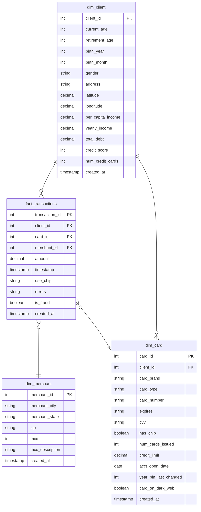

# Business Intelligence Mini-Project

### Ömer Furkan Çoban


An end-to-end BI solution for analyzing credit card transactions, detecting fraud, and visualizing key performance indicators (KPIs) using PostgreSQL and Metabase.

## Architecture

The project uses a containerized architecture with three main services:

1. **PostgreSQL (`bi_postgres`)**: Stores the Star Schema data warehouse (Fact + Dimensions).
2. **Metabase (`bi_metabase`)**: Provides the visualization layer and dashboard.
3. **Data Importer (`bi_data_importer`)**: Python container for running ETL scripts.

### Star Schema

The project follows a standard Star Schema design for optimized analytical queries.



**Schema Summary:**

- **Fact Table:** `fact_transactions` (transaction_id, amount, timestamp, is_fraud)
- 
-  **Tables:**
  - `dim_client`: (client_id, yearly_income, credit_score, age)
  - `dim_card`: (card_id, card_brand, card_type, limit)
  - `dim_merchant`: (merchant_id, mcc, merchant_state)

## Deployment

Choose one of the two methods below to deploy the entire stack.

### Method 1: Fully Automated Docker Deployment (Recommended)

This is the most reliable method as it handles all dependencies inside Docker.

1. **Requirements**: Docker Desktop installed.
2. **Action**: Run the containers:
   ```bash
   docker-compose up -d
   ```
3. **What happens?**:
   - 13.3M record dataset is downloaded and extracted.
   - Database schema is initialized.
   - ETL pipeline runs automatically.
   - Metabase dashboard is configured.

---

### Method 2: Interactive Deployment Script (Alternative)

Use this if you want to see the step-by-step progress in your local terminal.

1. **Requirements**: Docker, `curl`, and `unzip` installed locally.
2. **Action**:
   ```bash
   chmod +x deploy.sh
   ./deploy.sh
   ```

---

### Monitoring & Access

1. **Monitor Progress**:
   Check the importer logs to see ETL and setup status:

   ```bash
   docker logs -f bi_data_importer
   ```
2. **Access Dashboard**:
   Once logs show "ENTRYPOINT COMPLETE," visit:

   - **URL**: [http://localhost:3000](http://localhost:3000)
   - **Credentials**: `admin@admin.com` / `Password123!`
   - **Dashboard**: Financial Transactions Analytics

## scripts Directory

- `etl_main.py`: Main ETL pipeline (Extracts CSVs, Transforms to Star Schema, Loads to Postgres).
- `setup_dashboard.py`: Configures Metabase via API, creates 30+ Cards, and builds the Dashboard layout.

## ETL Pipeline & Data Processing

The `etl_main.py` script performs significant data processing to ensure data quality and analytical readiness:

1. **Cleaning**:

   - **Currency Conversion**: Strips symbols (e.g., `$`, `,`) from fields like `amount`, `yearly_income`, and `total_debt` to convert them to numeric types.
   - **Timestamp Parsing**: Converts string date formats into PostgreSQL-compatible `TIMESTAMP` objects.
2. **Enrichment**:

   - **Fraud Labelling**: Joins transaction data with `train_labels.json` to flag transactions as `is_fraud` (True/False).
   - **MCC Descriptions**: Maps raw Merchant Category Codes (MCC) to human-readable descriptions (e.g., "Airlines", "Hotels") using `mcc_codes.json`.
3. **Normalization (Star Schema)**:

   - Transforms flat CSV data into a relational **Star Schema**.
   - **De-duplication**: Extracts unique Client, Card, and Merchant entities into their respective Dimension tables (`dim_client`, `dim_card`, `dim_merchant`) to eliminate redundancy.

## Key Metrics Implemented

- **Transaction Volume**: Total volume, counts by period (Year/Month/Week).
- **Fraud Analysis**: Fraud rates by Merchant Category (MCC) and State.
- **Customer Risk**: Debt analysis, specific metrics for customers with >2 cards.
- **Utilities**: Special analysis for MCC 4900 (Utilities) transactions.
- **Business Metrics**: Consolidated view of Total Volume, Avg Credit Score, etc.

## Troubleshooting

**Metabase shows "Still Waiting..." or generic errors:**

- Ensure the ETL completed successfully.
- Run `docker logs bi_metabase` to check for specific internal errors.

**Visualizations look wrong:**

- Ensure `setup_dashboard.py` ran *after* the ETL.
- You can re-run the dashboard setup manually:

  ```bash
  docker exec bi_data_importer python /scripts/setup_dashboard.py
  ```

**Database connection failed:**

- Check container status: `docker ps`
- Ensure port 5432 is not occupied by a local Postgres instance.
