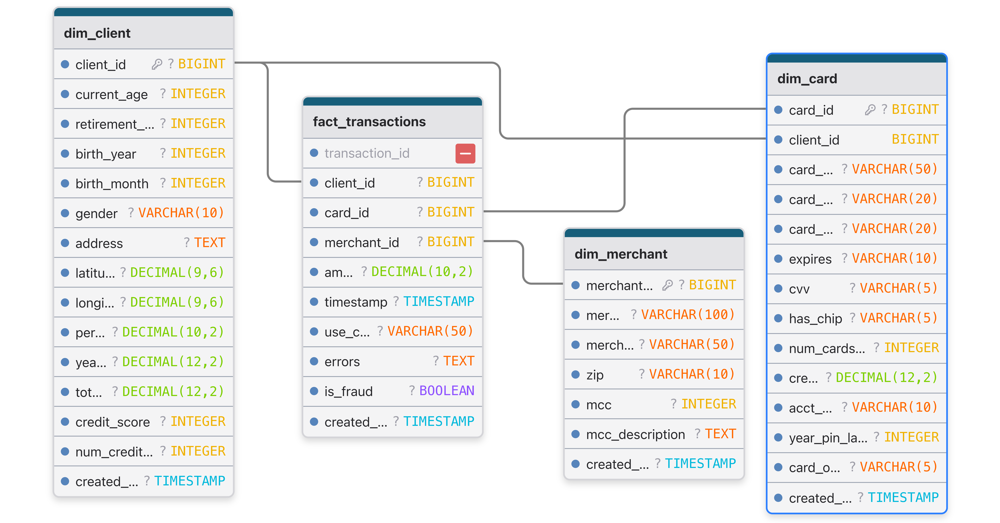

# Transaction Analytics Project

## Business Intelligence Mini-Project

**Author:** Ömer Furkan Çoban
**Date:** 2026-02-04

---

# Project Overview

**Objective:**
Analyze 13.3 million credit card transactions to identify fraud patterns, customer behavior, and business performance metrics.

**Key Goals:**

* **Fraud Detection:** Analyze fraud rates by category and location.
* **Customer Insights:** CLV, debt analysis, and demographic trends.
* **Performance:** High-performance data warehousing.
* **Automation:** Full Docker-based deployment (ETL + Viz).

---

# Technical Architecture

A modern, containerized BI pipeline:

1. **Extract & Transform (ETL)**

   * **Python (Pandas)**: Cleans and enriches raw CSV/JSON data.
   * **Automation**: Checks for new files and processes in chunks (100k rows/batch).
2. **Data Warehouse**

   * **PostgreSQL**: Stores data in a **Star Schema** for analytical performance.
   * **Database**: `transaction_analytics` (formerly `fraud_detection`).
3. **Visualization**

   * **Metabase**: Interactive dashboard with 30+ KPIs and charts.
   * **Automated Setup**: Dashboard layout created via Python API.

---

# ETL Pipeline Stages

Detailed breakdown of the data processing workflow:

1. **Extract**

   * Sources: `users.csv`, `cards.csv`, `transactions.csv`, `fraud_labels.json`.
   * Ingestion: Automated download via `entrypoint.sh` (450MB+).
2. **Transform**

   * **Cleaning**: Removal of currency symbols (`$`), timestamp parsing.
   * **Enrichment**: Mapping MCC codes to descriptions.
   * **Typing**: Casting columns to correct SQL types (Integer, Decimal).
   * **Logic**: Calculating fraud flags from `fraud_labels.json`.
3. **Load**

   * **Batch Insert**: Using `psycopg2.extras.execute_batch` for speed.
   * **Order**: Dimensions (`dim_client`) → Fact (`fact_transactions`).

---

# Data Quality & Cleaning

Ensuring analytical accuracy through rigorous preprocessing:

* **Currency Cleaning:**

  * Removed `$` symbols and `,` separators to enable numerical calc.
  * *Impact:* Enabled aggregations on `amount`, `yearly_income`.
* **Timestamp Standardization:**

  * Parsed mixed formats into standard PostgreSQL `TIMESTAMP`.
  * *Impact:* Accurate time-series analysis (e.g., Daily Fraud Trends).
* **Handling Missing Values:**

  * Identified and filtered `NaN` values in critical columns.
  * *Impact:* Prevented SQL insertion errors and skewed averages.

---

# Data Model: Star Schema

Centralized design for analytical efficiency.

**Fact Table:** `fact_transactions`

* **Measures**: `amount`, `is_fraud`
* **Keys**: `client_id`, `card_id`, `merchant_id`

**Dimension Tables:**

* `dim_client`: Demographics (Age, Score)
* `dim_card`: Card Details (Limit, Brand)
* `dim_merchant`: Context (Location, MCC)

---



---

# Key Insights: Fraud Analysis

**1. High-Risk Categories (MCC)**

* Certain merchant categories show significantly higher fraud rates.
* analysis verified using `vw_fraud_by_category`.

**2. Geographic Hotspots**

* Fraud distribution across states visualized in Metabase.
* Metric: `Fraud %` vs `Total Volume`.

**3. Customer Risk Profiles**

* Correlation between **Credit Score** and **Fraud Susceptibility**.
* Analysis of "Card on Dark Web" vs "Actual Fraud Events".

---

# KPIs & Custom Metrics

Standard and measured business performance indicators:

* **Standard KPIs:**

  * **Revenue:** Sum of valid transaction amounts.
  * **Volume:** Count of processed payments.
  * **Fraud Rate:** % of fraud transactions.
* **Custom Calculated Metrics:**

  * **Income per Card:** `Yearly Income / Num Cards` (Credit reliance).
  * **Debt Ratio:** `Total Debt / Yearly Income` (Default probability).
  * **CLV Score:** `(Income * Age) / Total Debt` (Long-term value).

---

# Dashboard Highlights

The **Financial Transactions Analytics** dashboard includes 32 cards:

* **Business Health:** Total Volume, Transaction Counts (Year/Month/Week).
* **Risk Metrics:** Top 10 Debt Holders, Refund Rates for Dept Stores.
* **Customer Value:** CLV (Customer Lifetime Value) scoring.
* **Demographics:** Income vs. Credit Limit, Gender-based spending.

---

# Deployment & Automation

**One-Click Start:**

```bash
docker-compose up -d
```

**What happens?**

1. **Docker Compose** spins up Postgres, Metabase, and Data Importer.
2. **Data Importer** downloads 450MB+ dataset automatically.
3. **ETL Script** processes 13M rows → PostgreSQL.
4. **Dashboard Script** configures Metabase connection and builds 32 charts.
5. **Ready:** User logs in to `localhost:3000`.

---

# Conclusion & Future Work

**Achievements:**

* Built a scalable, automated BI solution.
* Solved data quality issues (cleaning currencies, timestamps).
* Delivered actionable insights on fraud.

**Future Improvements:**

* Real-time streaming (Kafka/Spark).
* Machine Learning model integration for predictive fraud detection.

---

# Thank You!

**Questions?**
